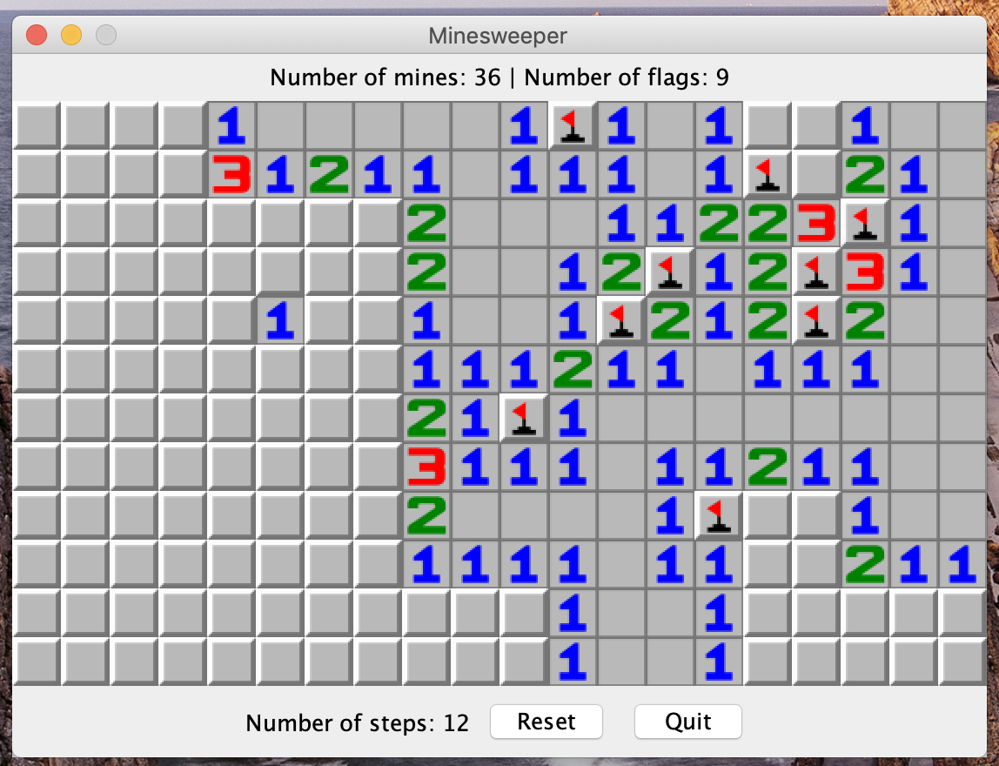
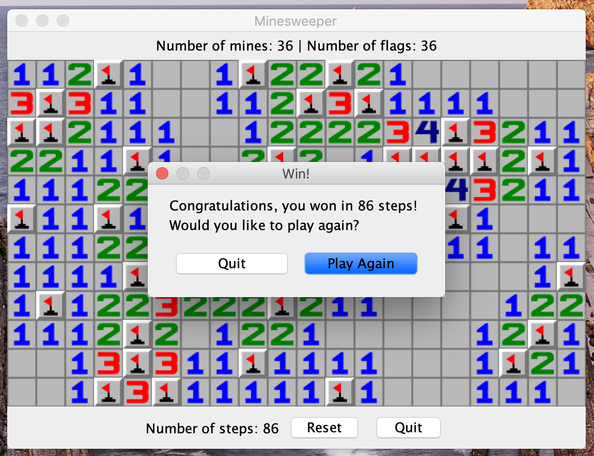
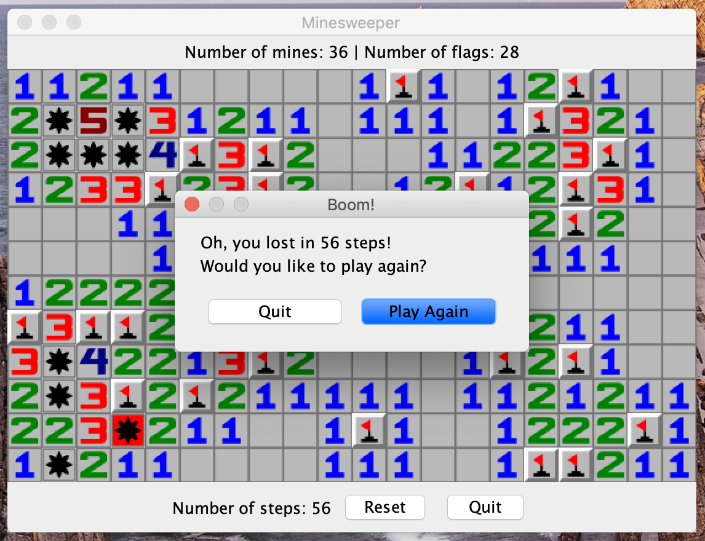

# Minesweeper
A minesweeper game based on Java using MVC design.

## How to run
```bash
cd Minesweeper
mvn install
cd target
java -jar Minesweeper.jar arg1 arg2 arg3
# arg1 = the width of the game board, default is 20
# arg2 = the height of the game board, default is 12
# arg3 = the number of the mines, default is 36
```

## Examples

---

---

