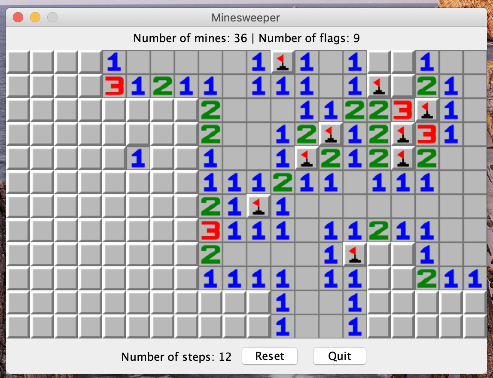
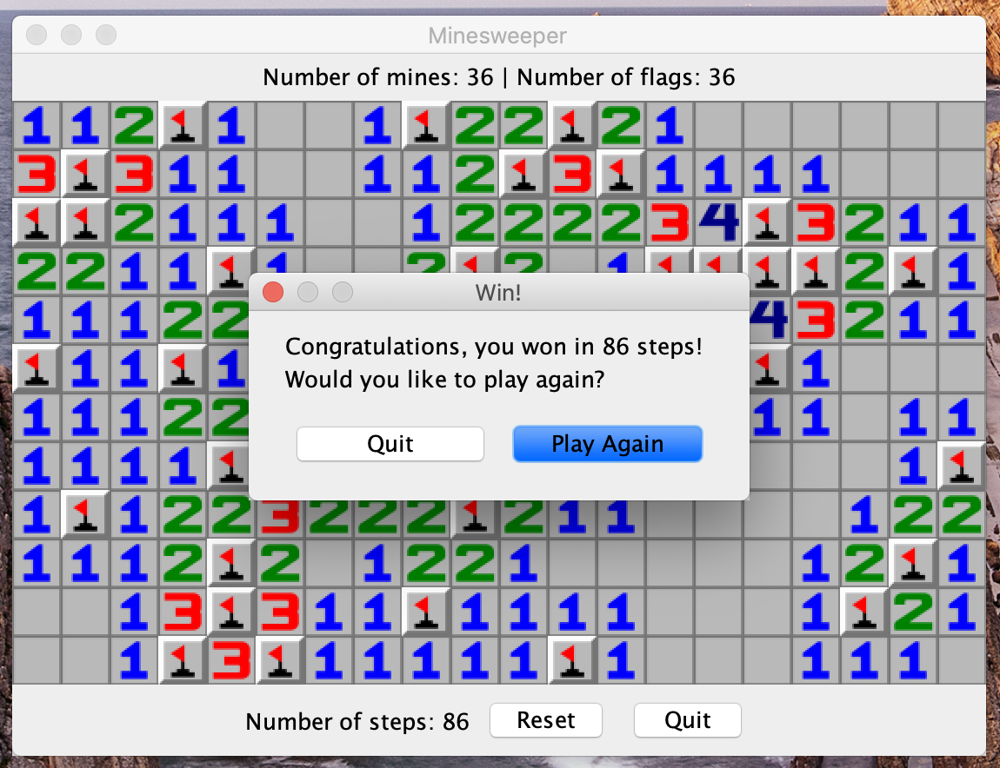
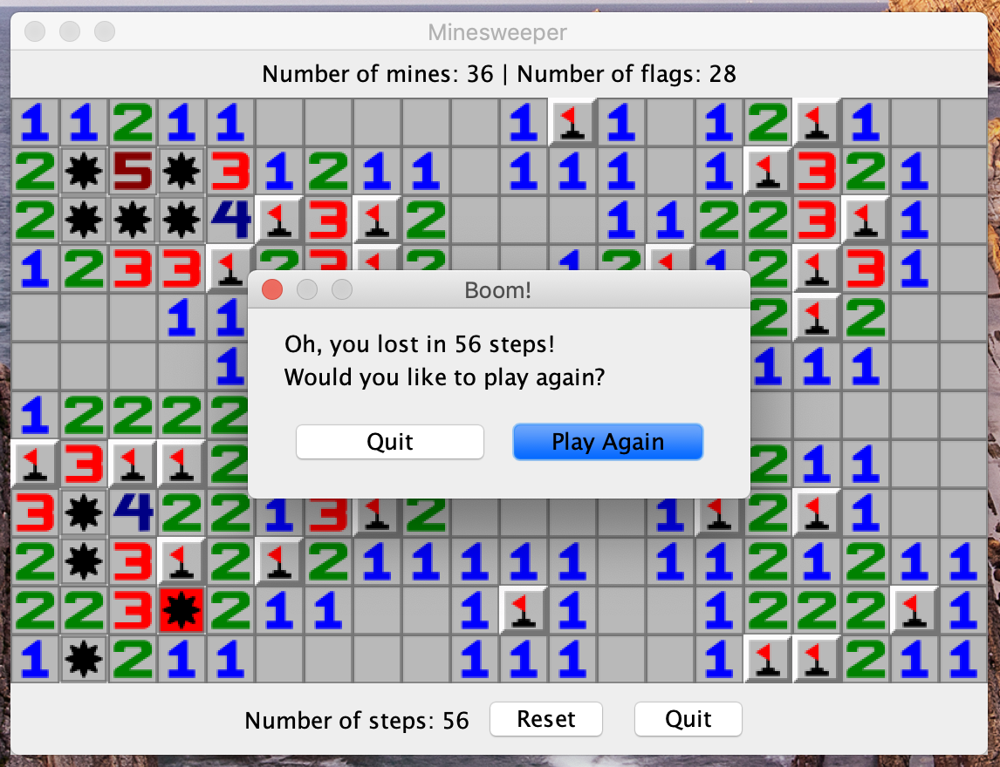

# Minesweeper

A desktop Minesweeper game built with Java Swing and a Model-View-Controller (MVC) architecture.

## Highlights

- Configurable board dimensions and mine count
- First-click safety and iterative flood-fill for connected empty cells
- Clear separation between game state, interaction logic, and Swing components
- Programmatically rendered, accessible board tiles with no external artwork
- No external runtime dependencies
- Java 8-compatible bytecode

## Requirements

- Java 8 or newer

The Maven Wrapper is included, so a separate Maven installation is not required.

## Run

### macOS or Linux

```bash
./mvnw clean package
java -jar target/minesweeper.jar
```

### Windows

```powershell
.\mvnw.cmd clean package
java -jar target\minesweeper.jar
```

To start a custom game, pass the width, height, and mine count:

```bash
java -jar target/minesweeper.jar 30 16 99
```

### IntelliJ IDEA

1. Open the repository folder.
2. Import the detected Maven project.
3. Select the shared **Minesweeper** run configuration and run it.

## Controls

- **Left-click:** reveal a square
- **Right-click:** add or remove a flag
- **Reset:** start a new board with the current settings
- **Quit:** close the game

## Game Parameters

| Parameter | Minimum | Default | Maximum |
| --- | ---: | ---: | ---: |
| `width` | 10 | 20 | No fixed limit; large boards scroll |
| `height` | 5 | 12 | No fixed limit; large boards scroll |
| `mines` | 1 | 36 | `width * height - 1` |

All three arguments must be supplied together. Invalid or missing values use the documented defaults.

## Architecture

- **Model:** `GameModel` owns board state, first-click-safe mine placement, flood-fill, counters, and win detection.
- **View:** `GameView` and `DotButton` render the model with Swing components.
- **Controller:** `GameController` translates user input into model operations and presents game completion.
- **Entry point:** `Minesweeper` validates command-line settings and starts the UI on Swing's event dispatch thread.

The model does not expose its mutable cells. Its package-private random-source constructor also allows deterministic examples or checks without changing production behavior.

## Screenshots

| In progress | Won | Lost |
| --- | --- | --- |
|  |  |  |

## License

The application source is available under the [MIT License](LICENSE). The generated Maven Wrapper
scripts remain under the Apache License 2.0; see [THIRD_PARTY_NOTICES.md](THIRD_PARTY_NOTICES.md).
